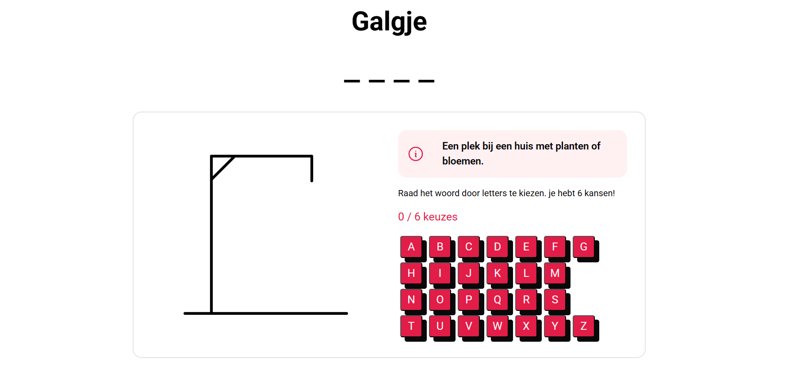

# @work-2 Project 1 - Hangman 🎮

## Introduction 📖  

Hangman is a classic word-guessing game where players try to guess a hidden word one letter at a time. With each incorrect guess, a part of the hangman is drawn, bringing the player closer to losing. This digital version of Hangman provides an interactive and fun way to play the game, complete with a virtual keyboard, hints, and a visual representation of the hangman. The game challenges players to think critically and improve their vocabulary while having fun.

## GitHub Pages 🌐 
[Visit Website](https://pgmgent-atwork2.github.io/project-1-workshop-start-to-code-quinten-en-liam/)

## Brainstorm 💡  
[Brain storm here](https://www.figma.com/board/X1btACPtV4hZRVeZnwxHG0/Untitled?node-id=0-1&t=4AocDz8qDj0Ebm01-1)

